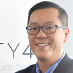

## Personal data
  
Name: Kevin Huang  
Location: 
## Projects 
Name: [Lydian](../projects/lydian.md)  
Position: Managing Director – Asia  
## Contacts
[LinkedIn]()  
[Facebook]()  
[Twitter]()  
[Reddit]()
[Blog]()
## About
Kevin leads Gravity4’s activities in Asia and is responsible for the company’s expansion and growth initiatives in the region. Prior to Gravity4, Kevin was CEO of Pixels, one of the largest independent multi-screen advertising technology companies in Asia, acquired by Gravity4 in November 2015. Kevin is a well-respected leader in the digital marketing and is considered a pioneer with over 18 years of experience in Asia. Prior to co-founding Pixels, Kevin held positions at 247 Media Asia and DoubleClick Media Asia. Kevin was awarded Digital Marketing Hero 2014 by the Hong Kong Association of Interactive Marketing (HKAIM) and Finalist, Young Entrepreneur Award 2015 by the South China Morning Post. Kevin is a graduate of Pace University with a degree in Computer Information Systems.