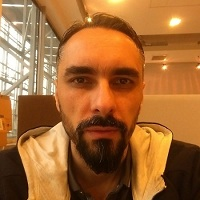

## Personal data
  
Name:    Konrad Szalapak  
Location: Poland
## Projects 
Name: [Stable](../projects/stable.md)  
Position: Lead Developer   
## Contacts
[LinkedIn](https://www.linkedin.com/in/konradszalapak/)    
[Twitter](https://twitter.com/konradszalapak)  
## About
Konrad has 20 years of experience in various software ventures in Finance, Internet and ICT industries. He started his business as a Linux sysadmin, subsequently he became a software developer in the very first Polish web portal, Wirtualna Polska. Then, after 3 years, he started offering software development services as an independent entrepreneur. His project portfolio includes:
- Hedge fund creation for BZWBK (The Santander Group) in Luxembourg: algorithmic strategies development, integration with brokers,
- BZWBK Private Banking: back office automation solutions,
- GE Money Bank: Big Data transformation,
- Investors TFI <-> JP Morgan integration: algorithmic interface for global futures exchanges,
- mobile apps development,
- corporate level software development projects for: telecoms, integrators, government, e-commerce, renewable energy.  

For the past 7 years he has co-founded and run several technology startups. Among his activities were business growth and programming of created products - software systems. One of his startups was funded by VC company and another one has been chosen to the Starter Rocket Acceleration Programme. Two of his startups now sell licences for their developed products which have become profitable assets.
For the past 10 years he has traded in the financial markets as a discretionary and algorithmic trader of currencies and indexes. He has programmed and backtested trading algos. Konrad studied Information Technology and Production Management at Gdańsk University of Technology.

