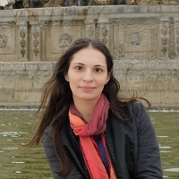

## Personal data
  
Name:   Kristina Kalcheva  
Location: Bulgaria
## Projects 
Name: [Ignis](../projects/ignis.md)  
Position: Co-founder & Managin Director
## Contacts
[LinkedIn](https://www.linkedin.com/in/kristina-kalcheva/)    
## About
Kristina Kalcheva is a legal specialist and a co-founder of Jelurida.
She has a Master of Law and International Relations Degree from Sofia University and has been working as a legal advisor for seven years. She has experience with private national, European and International Law. Her professional skills are in the area of Human Rights and Intellectual Property Rights protection on both national and international level. Part of her job in the company is to explore the different open source licensing models and their enforceability in practice. In the last two years her professional interests are also focused on researching the various possibilities and use cases of applying blockchain technology in real life areas and the arising legal challenges along the way.
