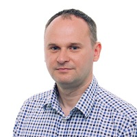

## Personal data
  
Name:    Krzysztof Kolaczynski  
Location: Poland
## Projects 
Name: [Stable](../projects/stable.md)  
Position: Co-founder 
## Contacts
[LinkedIn](https://www.linkedin.com/in/krzysztof-kolaczynski-14b802ba/)    
## About
Krzysztof has 15 years of experience in the financial industry. His first job was an FX Dealer position in Raiffeisen Bank Poland, where he was responsible for conducting Foreign Exchange and Interest Rate transactions with the bank’s clients. The vast majority of such transactions were for the FX hedging purposes. After 3 years he left Raiffeisen Bank Poland and started working in a similar position for BRE Bank (a member of Commerzbank AG Group). From 2005 until 2012 he worked at Bank Zachodni WBK (a member of Banco Santander Group) as FX Dealer, and after that as Structured Products Manager in a bank’s dealing room where he was responsible for implementation and development of FX Options, Interest Rate Swaps and composing tailor made hedging strategies. In September 2007 he was promoted to Deputy Director/Chief Market Strategist position in Private Bank Department where he was executing trades with the investment banks on all major asset classes - equities, commodities, FX, Interest Rate, freight indices, CDS and bonds (both sovereign and corporate). He also developed the first synthetic bond in Poland for the bank’s clients. In 2012 he joined Investors TFI – a Polish fund management company where he was Portfolio Manager of two unique funds developed by him from scratch: a fully systematic/algorithmic fund and a Fund of Hedge Funds. Since May 2016 he has been working for Liechtenstein-based hedge fund AIMHedge in Research & Development Department. He specializes in systematic/quantitative trading, especially in volatility and index arbitrage field. He has been an active cryptocurrency miner and investor for the past couple of years. He holds a Master Degree from University of Gdansk. He passed CAIA Level 1 in 2011.

