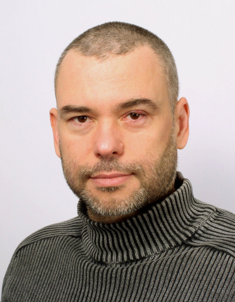

## Personal data
  
Name: Leszek Rychlewski  
Location: Poland  
## Projects 
Name: [Adshares](../projects/adshares.md)  
Position:  Co-Founder   
## Contacts
[LinkedIn](https://www.linkedin.com/in/leszek-rychlewski-b3510b/)  
## About
20 years of experience in software development for big data and bionformatics applications. Over 100 publications (h-factor > 40). Author of a 28nm BTC mining ASIC. CEO of the BioInfoBank Institute. Member of supervisory board of BIB Seed Capital and few biotech companies. Advisor of the Polish Bitcoin. Society  