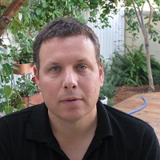

## Personal data
  
Name:   Lior Yaffe  
Location: Israel
## Projects 
Name: [Ignis](../projects/ignis.md)  
Position: Co-founder & Managin Director  
Name: [Ardor](../projects/ardor.md)  
Position: Core Developer  
## Contacts
[LinkedIn](https://www.linkedin.com/in/lior-yaffe-61106b1/)   
[Facebook](https://www.facebook.com/lior.mor.yaffe) 
## About
[Lior Yaffe explains about the Ardor Blockchain](https://www.youtube.com/watch?v=oFJktzua1f4)  
As a 3 years old kid, Lior used to multiply double digits numbers in his head in a split second. At 13, he got his first computer and developed programs for fast prime calculations, finding Pythagorean triples and calculating polynomial approximations. Lior has a B.A. in computer science from the Technion in Haifa. He eats and drinks programming and technology and has worked in various companies from startups to large corporations, specializing in software development of enterprise applications. He is a true believer in Blockchain technology and its potential to change the world.

 
