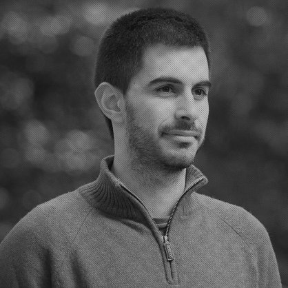

## Personal data
  
Name: Luis Ferreira  
Location: USA
## Projects 
Name: [UTrust](../projects/utrust.md)  
Position: Head of Engineering 
## Contacts
[LinkedIn](https://www.linkedin.com/in/zamith/)  
[Twitter](https://twitter.com/Zamith)  
[Blog](http://blog.zamith.pt/)
## About
Working at Subvisual for more than 5 years, he specializes on the development of complex web-centered solutions, using Ruby and RoR. He has a fondness for open source tech and giving back to the community. He is an accomplished Rails mentor, teaching in workshops, university classes and events. He also loves experimenting with new, fun programming languages, from Haskell to Elixir or even Crystal.
