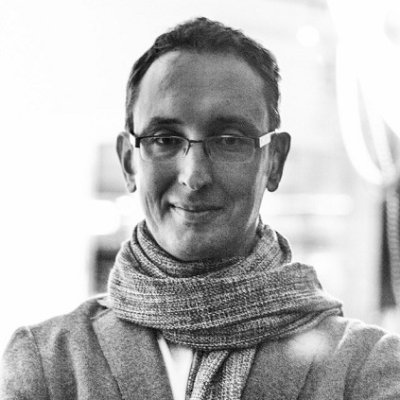

## Personal data
  
Name: Maksim Balashevich    
Location: Frankfurt Am Main Area, Germany  
## Projects 
Name: [Santiment](../projects/santiment.md)  
Position: Founder  
## Contacts
[LinkedIn](https://www.linkedin.com/in/maksim-balashevich-640a8948/)  
[Website](http://maksimbala.com/)
## About
Serial product creator and entrepreneur, from early work at IBM to co-founding a successful hosting company. After a 7-year break to study meditation, yoga, and modern financial systems analysis, he returned to introduce German quality to a social trading startup, then after 3 years left to follow a new passion… cryptocurrencies.