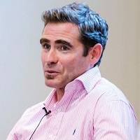

## Personal data
  
Name:   Mark O’Byrne  
Location: Ireland  
## Projects 
Name: [Globitex](../projects/globitex.md)  
Position: Advisor   
## Contacts
[LinkedIn](https://www.linkedin.com/in/markobyrne/)  
[Twitter](https://twitter.com/marktobyrne)  
[Blog](https://medium.com/@mark.obyrne)
## About
Mark O'Byrne serves as advisor to Globitex in areas concerning physical gold trading and delivery. Mark is the research director of GoldCore which he founded in 2003. He is a leading international gold expert and a respected speaker on precious metals, investments, markets, geo-politics, finance, fintech and money.
Mark has a BA in History and Greek and Roman Civilisation when he took a keen interest in financial history and the history of money. A historical perspective is very valuable in understanding today's financial markets and monetary system and the emerging technologies involving crypto-currencies and the blockchain.
He has an international media profile and appears on CNBC and Bloomberg frequently and has been interviewed and quoted by the Financial Times, Reuters, Wall Street Journal, Bloomberg, Dow Jones, Associated Press, BBC etc. He takes part in the Reuters Precious Metals Poll and the Bloomberg Gold Survey. Mark has spoken at investment conferences throughout the world and is passionate about financial and monetary reform.
Mark won the Moneymate Financial Analyst of the Year Award in 2006 when he correctly warned about property bubbles and the looming global financial crisis.
From the humble beginnings, GoldCore have become a leading international gold broker and have over 15,000 clients in over 140 countries, sales of over $1 billion and over $130 million in bullion assets under management & storage. The group completed the sale of their wealth management division in 2015.
