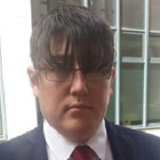

## Personal data
  
Name:   Maxim Elsner  
Location: Switzerland  
## Projects 
Name: [Narbonne](../projects/narbonne.md)  
Position: Founder & CEO   
## Contacts
[LinkedIn](https://www.linkedin.com/in/maxim-elsner-051b8814a/)    
## About
Max founded AFCOM.TECH, currently one of Europe's leading companies specializing in software development for microfinance and banking. He has been awarded the Microsoft Research. Before Afcom.Tech, Max worked at the NYSE as an Analyst, and at ANG Capital as Director of the Department of Trade Operations. Supports over 50 companies in the finance and banking sector as an external expert/consultant.
