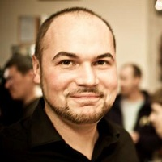

## Personal data
  
Name:   Maxim Prasolov  
Location: Ukraine  
## Projects 
Name: [Neuromation](../projects/neuromation.md)  
Position: Founder & CEO   
## Contacts
[LinkedIn](https://www.linkedin.com/in/maxim-prasolov/)      
[Facebook](https://www.facebook.com/maxim.prasolov.5)
## About
As a multimedia producer during 2001 – 2017 Maxim has produced more than 50 animated commercials, 3D-movies, commercial and industrial applications, computer games. Worked with international retail and industrial brands such as Unilever, Yukos, TPE, Metro Cash&Carry, Severstal Group, Ferrexpo, commercial banks, investment and insurance companies. Prasolov has been a member of the IPO team of Ferrexpo on the London Stock Exchange, the biggest iron ore producer in Ukraine. Since 2014 he has been investing in drones development, AI, AR multimedia start-ups.
