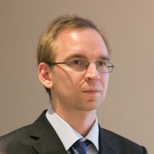

## Personal data
  
Name: Michael Egorov  
Location: USA  
## Projects 
Name: [Fluence](../projects/fluence.md)  
Position: Advisor  
## Contacts
[LinkedIn](https://www.linkedin.com/in/michael-egorov-77663332/)  
[Facebook](https://www.facebook.com/michael.egorov.92)  
[Twitter](https://twitter.com/newmichwill)  
[Github](https://github.com/michwill)  
[Bitbucket](https://bitbucket.org/michwill/)
## About
Michael is a CTO and co-founder of Nucypher, a company providing an encryption layer for popular Big Data frameworks. After obtaining a PhD in physics from Swinburne University he built ZeroDB, an open source end-to-end encrypted database.
