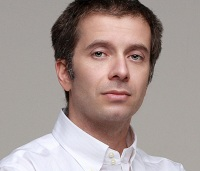

## Personal data
  
Name:   Michael Marcovici  
Location: Austria  
## Projects 
Name: [Digital Developers Fund](../projects/digital_developers_fund.md)  
Position: Managing Director   
## Contacts
[LinkedIn](https://www.linkedin.com/in/michael-marcovici-aa963614/)    
[Twitter](https://twitter.com/domaindevfund)  
[Facebook](https://www.facebook.com/michael.marcovici)
## About
Michael Marcovici’s expertise in online business stretches back to 1991, when the Internet still worked without WWW or domains. Back then, he published the Austria Boersenbrief, a financial experts magazine, and was a private equity fund manager.
In the 2000s, Michael established a trading company that grew to eBay's biggest powerseller - worldwide. 
Michael became involved with domains in 2002. He started to register valuable domains and grew a sizeable portfolio. Within a few years, the domain venture grew into the Domain Developers Fund, a Cayman Island-based investment company. Michael developed a semantic and economic strategy to identify undervalued domains in the market, based on the data derived from hundreds of thousands of domain transactions.
Besides being active in digital assets, Michael is a recognized artist, whose contemporary works often on the edge between business and art, have been in featured on Saatchi Art, Vice, The Atlantic, or Forbes.
