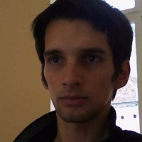

## Personal data
  
Name:   Mihai Dumitrescu  
Location: USA  
## Projects 
Name: [Lampix](../projects/lampix.md)  
Position: CTO   
## Contacts
[LinkedIn](https://www.linkedin.com/in/mdumitrescu/)    
## About
Mihai is the Founder and CTO of Rosoftlab, a research and development firm in computer vision, augmented reality and related mobile and web apps working for international customers, and also the founder of VanillaNAV, an AR-based indoor navigation system. George and Mihai met as speakers, in the backstage of TEDx Bucharest in 2013.
