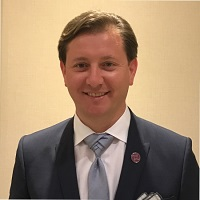

## Personal data
  
Name:   Mike Costache  
Location: USA  
## Projects 
Name: [TaaS](../projects/taas.md)  
Position: Advisor   
## Contacts
[LinkedIn](https://www.linkedin.com/in/mikecostache/)      
[Facebook](https://www.facebook.com/mikecostache)  
[Twitter](https://twitter.com/mikecostache)  
[Blog](https://medium.com/@mikecostache)
## About
Mike never liked being put in a box so he spent the last 20 years as an entrepreneur, investment banker, author, professor, speaker, angel investor and fundraiser for various charities.
Currently, Mike is a Managing Partner at KrowdMentor, a strategic investment and advisory firm empowering blockchain startups, funds and entrepreneurs to reach their funding and liquidity goals. Mike is also the founder of the Blockchain Investors Consortium (BIC) and serves on the Advisory Board of Token-as-a-Service (TaaS), the first ever tokenized closed-end fund dedicated to investments in blockchain assets. 
Since 2011, Mike is a member of Tech Coast Angels (TCA), a network of 330 angel investors in Southern California who have invested $185 million in 300+ deals and raised over $1.5 billion from VCs.
From 2006 to 2011, Mike was the President of Leo & Leo, which represented brands such as Maserati, Segway, NetJets, PrivatSea, Sunseeker Yachts, NetSuite, Marsh, Orgil Greenhouses, Miss Universe, and Rockstar Energy Drink. Total sales amounted to €60 million.
From 2000 to 2006, Mike served as founding CEO of Pioneer TeleCare, an e-commerce firm with total revenues of $4 million. From 1998 to 2003, Mike was an Associate at WestPark Capital, The Interlink Group, Millennium Capital Partners, all LA-based i-banks.
Mike holds a degree in Economics (1999) from Pepperdine University (Malibu, California), a Certificate in Negotiations, Arbitration, and Mediation (2003) from Pepperdine’s School of Law and has completed the Program on Negotiations for Senior Executives (2008) at Harvard.
Born in Romania in 1977, Mike migrated to Israel in 1988 and in 1992 to the United States. Mike is fluent in English, Hebrew, Romanian and has basic knowledge of French. Mike was featured in USA Today, Wall Street Journal, Inc., Entrepreneur, CCTV, Business Week, Men's Health, Top Gear and numerous other media outlets.
