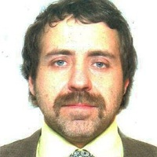

## Personal data
  
Name:   Mikhail Astakhov  
Location: Russian Federation  
## Projects 
Name: [IMMLA](../projects/immla.md)  
Position: Co-founder    
## Contacts
[LinkedIn](https://www.linkedin.com/in/mikhailartislifeastakhov/)    
## About  
For more than ten years Mikhail is engaged in the international logistics. He was executive vice-president for strategy and staff in the international transport holding Global Transport Investments, where his team developed and implemented staff management system, having increased productivity by 65%, and also carried out the restructuring of the Russian branch of The company. Then Mikhail became a partner and was responsible for the development of the Aistlog group. Since 2016 Mikhail is concentrated on the creation and start up of the IMMLA. He carries out the selection of the main participants of the consortium, also he is responsible for the interaction of the command managers, the strategy of the project development in the five-year horizon and implementation of professional expertise.
