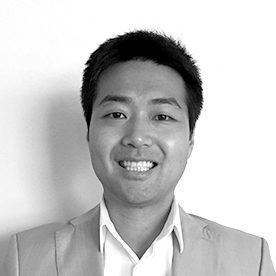

## Personal data
  
Name: Min Kim    
Location: South Korea
## Projects 
Name: [ICON](../projects/icon.md)  
Position: Foundation Council
## Contacts
-//-
## About
He has more than 12 years of experience as a director, entrepreneur, financial / M&A consultant, VC investor and mentor. He is currently the CGO of the DAYLI Intelligence and previously began his career in technology IB at Deutsche Bank, where he served as COO at Tapas Media, the US digital content sales platform, helping to establish the largest online community. He majored in business at UC Berkeley.
