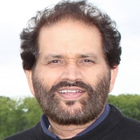

## Personal data
  
Name:    Narinder Bajwa   
Location: USA
## Projects 
Name: [Gluon](../projects/gluon.md)  
Position: Co-founder & CIO 
## Contacts
[LinkedIn](https://www.linkedin.com/in/narinder-bajwa-5401741/)      
## About
Was CTO and Chief Software Architect at Infonox, a FinTech company specializing in financial payments. He was instrumental in writing Infonox’s payment platform which led to the company’s acquisition by TSYS. He brings his advanced knowledge of banking systems and software to the current secure structure of the Gluon platform. He holds a bachelor’s degree in electrical and electronics engineering and a master’s degree in computer science from the India Institute of Technology Bombay (IITB).
