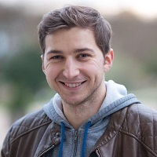

## Personal data
  
Name:   Nicolas Wagner  
Location: France  
## Projects 
Name: [Dether](../projects/dether.md)  
Position: Blockchain Developer   
## Contacts
[LinkedIn](https://www.linkedin.com/in/nicolas-wagner-ab59249a/)  
[Twitter](https://twitter.com/w_n1c01a5)
## About
Nicolas is a self-taught developer who has worked for Tradelab, Novactive,
Air France and the French Administration. Beginning in June 2016, he became
interested in blockchain technology. The transparent and disintermediate
dimension of this blockchain protocol convinced him that it would be the next
technology that would disrupt technology and society, just as the internet did
in the 1990s. He won many hackathons (2nd BeMyApp, 2nd Startup weekend
blockchain, 1st prize at Merkle Week with Dether). In addition, he regularly
contributes to blockchain projects (Kleroterion, Abie fund) and frequently
organizes blockchain workshops (HackerHouse, Blockfest).
