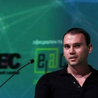

## Personal data
  
Name:   Nikola Alexandrov  
Location: Bulgaria  
## Projects 
Name: [LockChain](../projects/lockchain.md)  
Position: Co-founder & CEO   
## Contacts
[LinkedIn](https://www.linkedin.com/in/nikola-alexandrov-12b73a9/)    
[Twitter](https://twitter.com/nikolaalx)  
[Facebook](https://www.facebook.com/nikolaalx)
## About
Co-founder of Bitcoin7 - among the first bitcoin exchanges way back in 2011, 3rd in volume worldwide at its time. 
4 Years of experience in the development of travel industry meta-search aggregator (BookingSpot). 
Founder of theSEO.com - digital marketing agency, winner of the Forbes E-volution award 2015 for best SEO agency and founder of the proprietary "E-Cron" online retailing brand with more than 150,000 customers per year in 30+ countries and registered trademark in 28 countries. 
Strong expertise in the field of digital marketing, e-commerce and fintech algorightms. Has recently been featured on the cover of the "Manager" magazine in Bulgaria.
