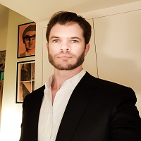

## Personal data
  
Name:   Nikolay Livadkin   
Location: France    
## Projects 
Name: [Kencoin](../projects/kencoin.md)   
Position: COO  
## Contacts
[LinkedIn](https://www.linkedin.com/in/livadkin/)     
[Twitter](https://twitter.com/nikolayliv)     
## About
Nikolay graduated from the prestigious ESSEC business school in France and later went to pursue a career in law. He later became the Senior Intellectual Property Attorney for Louis Vuitton. During his 18 years of working for Louis Vuitton, he gained a lot of insight on what clients want. Many clients want their privacy assured and to know that they are 100% secure while making a transaction. The emphasis Kencoin has on anonymity and security is what drew Nikolay to this project. He quickly established an extensive network in the adult industry worldwide. Kencoin’s guarantee of anonymity and security helped him expand that network.
