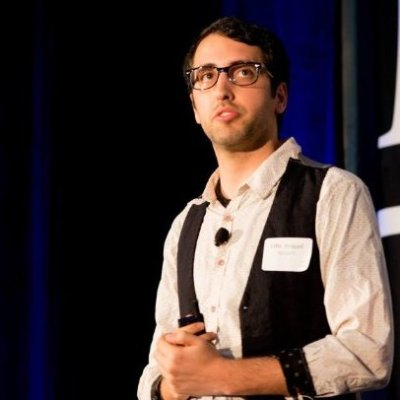

## Personal data
  
Name:  Ofir Avigad  
Location: San Francisco Bay Area  
## Projects 
Name: [Snip](../projects/snip.md)  
Position: Marketing  
## Contacts
[LinkedIn](https://www.linkedin.com/in/ofir-avigad-64888123/)  

## About
Growth and marketing strategy. Previously: co-founder of Credex, director of Growth at Jolt.us 
Serial entrepreneur, growth hacker, digital currency enthusiast.
During my career I've founded 4 projects, acting as a telemarketer, salesman, social media marketer, CMO, and currently crowd funding growth in the Blockchain industry.

I've been featured in Forbes' Israel 30 under 30 list for my work as an entrepreneur.

Among the projects I founded are: 
- A P2P trade network 2nd hand goods in Israel that received national media attention
- A B2B trade network in the Bay that went through the NFX.com class of winter 16'
- Started a successful FB community for inspiration in Hebrew
- A co-operative consisting of a restaurant, a workshop center, a hostel and a green roof
- And a marketing agency for impact oriented businesses and initiatives.