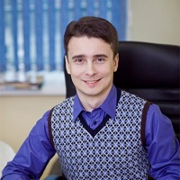

## Personal data
  
Name:   Oleg Razdzialouski  
Location: United Kingdom  
## Projects 
Name: [REALT](../projects/realt.md)  
Position: Co-founder   
## Contacts
[LinkedIn](https://www.linkedin.com/in/oleg-razdzialouski/)    
## About
Oleg has been committed to real estate industry since 2003, implementing software solutions and websites for a national property portal and major market players. One of the main focuses for Oleg is internet marketing, and his strategies for optimizing experience of websites have been very successful with customers; notably, Realt.by is used by the absolute majority of the national real estate market. Whilst specializing in the property digital marketing and advertising, Oleg is focused on software delivery due to his technical background and Master’s degree in Computer Science.
