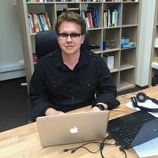

## Personal data
  
Name:   Paul Yakshankin  
Location: Russian Federation  
## Projects 
Name: [INS Ecosystem](../projects/ins_ecosystem.md)  
Position: CTO   
## Contacts
[LinkedIn](https://www.linkedin.com/in/paulyakshankin/)      
[Facebook](https://www.facebook.com/yakspavel)
## About
5+ years of leading development teams. Previously with Undev, FunBox and Voltmobi. RailsClub 2016 conference speaker. Experienced in Ruby, Javascript, Erlang.
