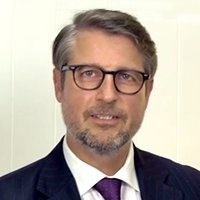

## Personal data
  
Name:   Peter Diedrich  
Location: Germany  
## Projects 
Name: [REALISTO](../projects/realisto.md)  
Position: Advisor   
## Contacts
[LinkedIn](https://www.linkedin.com/in/drpeterdiedrich/)      
## About
Peter is a founding partner of DSC LEGAL and specialises in advising national and international clients in nearly all aspects of real estate investments in Germany, German speaking countries and Central and Eastern Europe.
For more than 20 years, he has been advising clients in real property acquisitions, investments and financing. Peter also has experience and expertise in mergers and acquisitions, corporate law, international arbitration, and he is a notary public in Germany, specialising in real estate and corporate law.
After having successfully completed his parent house apprenticeship at Siemens, Peter studied law at Freie Universität Berlin and passed his bar exam in Berlin in 1989. From 1989 until 2010, Peter has been working as an attorney-at-law and partner law firms such as Gaedertz, Haarmann Hemmelrath, Ernst & Young and Olswang. In 1994, Peter received his doctor’s degree from the Faculty of Law of Freie Universität Berlin. In 1997, Peter was officially appointed as a notary in Berlin. He is also admitted to the Polish Bar (Adwokat). Since April 2013 Peter is Global Chair of the practice group Real Estate at International Referral.
Peter is chairman of the International Association of Jewish Lawyers and Jurists German Section e.V., Berlin (www.intjewishlawyers.org) and member of the board of governors of the mother organization (IAJLJ) in Tel Aviv. Furthermore, he is chairman of the executive board of Deutsch-Polnische Juristenvereinigung (www.dpjv.de).
