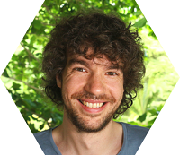

## Personal data
  
Name:   Philipp von Styp-Rekowsky  
Location: Germany  
## Projects 
Name: [Nimiq Network](../projects/nimiq_network.md)  
Position: Tech Lead   
## Contacts    
-//-
## About
BA at the German Research Center for Artificial Intelligence. MA at Max Planck Institute for Computer Science. PhD student to Professor Michael Backes at the Information Security and Cryptography Group at CISPA (Center for Cybersecurity, Privacy and Accountability). Built award-winning software AppGuard (over 2 million downloads, German IT Security Award) and Boxify (CeBIT Innovation Award). Published in several journals and technical reports. Personal passion for Blockchain technology and making security usable without compromising.
