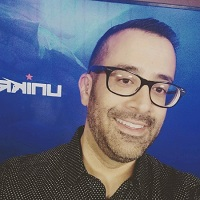

## Personal data
  
Name:   Rahul Sood  
Location: USA  
## Projects 
Name: [Unikrn](../projects/unikrn.md)  
Position: Co-founder & CEO   
## Contacts
[LinkedIn](https://www.linkedin.com/in/voodooftw/)    
[Twitter](https://twitter.com/rahulsood)  
[Facebook](https://www.facebook.com/voodoopc)  
[Blog](https://medium.com/@rahulsood)  
[Website](http://www.rahulsood.com/)
## About
Prior to Unikrn, Rahul Sood created the first incubation fund for startups at Microsoft. Microsoft later consolidated their global startup activities under Sood’s leadership. In June 2013, he launched Microsoft Ventures.
A serial entrepreneur, Sood spent 18 years in multiple startups prior to joining Microsoft. He founded luxury and gaming computer manufacturer Voodoo, which was acquired by Hewlett-Packard. Voodoo brought the ENVY and OMEN product lines to HP, contributing advanced technologies such as commercial liquid cooling and an increased focus on design.
With a deep background in video gaming and entertainment, Sood sits on the board of advisors for Razer, one of the largest gaming companies in the world. He is also an early investor and active advisor in Vrvana, a leading Mixed Reality hardware company based in Montreal, and also an active investor in New Jersey based Maingear PC (in which Unikrn has a large stake).
