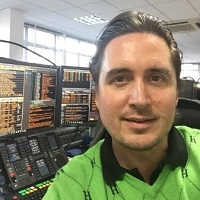

## Personal data
  
Name:   Ransu Salovaara  
Location: Gibraltar  
## Projects 
Name: [Ethbits](../projects/ethbits.md)  
Position: Escrow Agent & Advisor  
Name: [Globitex](../projects/globitex.md)  
Position: Advisor
## Contacts
[LinkedIn](https://www.linkedin.com/in/ransu/)  
[Twitter](https://twitter.com/ransu)  
[Facebook](https://www.facebook.com/ransu)
## About
Ransu is a co-founder and CEO at TokenMarket, an exchange and research company specialising in launching blockchain technology projects. He is also the CEO of Revolutra, which specialises in creating and marketing publicly traded, EU passported disruptive technology and investment products. Previously, Ransu headed European trading desk at Urram Investment firm, specialising in fixed-income trading of European investment grade, high-yield and convertible bonds. He has co-founded Zenigo company, connecting businesses with local customers through directories, social networks, site reviews and mobile apps. Ransu excels at company sales and content strategy development, where his experience was first honed by heading the EpicTV Adventure studio, licensing adventure sports films and documentaries from independent moviemakers. 
