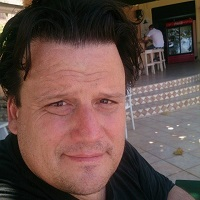

## Personal data
  
Name:   Richard Kastelein  
Location: Netherlands  
## Projects 
Name: [STACK](../projects/stack.md)  
Position: Advisor   
## Contacts
[LinkedIn](https://www.linkedin.com/in/expathos/)  
[Facebook](https://www.facebook.com/kastelein)  
[Twitter](https://twitter.com/expathos)    
[Blog](https://medium.com/@expathos)
## About
[Wikipedia](https://en.wikipedia.org/wiki/Richard_Kastelein)  
Founder of industry publication Blockchain News, partner at ICO services collective CryptoAsset Design Group, director of education company Blockchain Partners (Oracle Partner) & ICO event organiser - Richard Kastelein is an award-winning publisher & entrepreneur. He sits on the advisory boards of advised half a dozen Blockchain startups (ICOs) & has written over 1400 articles on Blockchain technology at Blockchain News & has also published on ICOs in Harvard Business Review & Venturebeat. 
Kastelein has spoken (keynotes & panels) on Blockchain in Amsterdam, Antwerp, Barcelona, Beijing, Brussels, Bucharest, Dubai, Eindhoven, Gdansk, Groningen, the Hague, Helsinki, London, Manchester, Minsk, Nairobi, Nanchang, San Mateo, Shanghai, Tel Aviv, Venice & Zurich. 
He's a Canadian (Dutch/Irish/English/Métis) whose writing career has ranged from the Canadian Native Press (Arctic) to the Caribbean & Europe. He's written occasionally for Harvard Business Review, Wired, Venturebeat, The Guardian & Virgin.com - his work & ideas have been translated into Dutch, Greek, Polish, German & French.
A journalist by trade, an entrepreneur & adventurer at heart, Kastelein's professional career has ranged from political publishing to TV technology, boatbuilding to judging startups, skippering yachts to marketing & more as he's travelled for nearly 30 years as a Canadian expatriate living around the world. His coolest jobs were as St. Maarten's 1st restaurant reviewer & Caribbean yacht delivery skipper for Sunsail. Worst jobs include washing dishes in a smorgasbord restaurant scraping full plates & landscaping in Australia with funnelweb spiders. 
He sailed around the world on small yachts & wrote a series of travel articles called, "The Hitchhiker's Guide to the Seas' travelling by hitching rides on yachts (1989) in major travel & yachting publications. He currently lives in Groningen, NL where he's raising three teenage daughters with his wife & sailing partner, Wieke Beenen.
