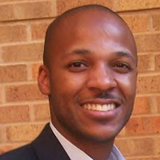

## Personal data
  
Name:      Rodney Witcher   
Location: USA
## Projects 
Name: [Wolk](../projects/wolk.md)  
Position: SVP of Product & Business Development    
## Contacts
[LinkedIn](https://www.linkedin.com/in/thimmappa/)     
[Facebook](https://www.facebook.com/rodneywitcher)  
[Twitter](https://twitter.com/rfw2)  
## About
Rodney's unique experience in engineering, product and business development over the last 15 years make him uniquely qualified to guide the creation of a first-in class product and user experience for Wolk partners. Rodney earned an BA in Computer Science and BBA in Management Information Systems from The University of Texas at Austin in 2002. He lives in San Mateo, California with his wife, Courtney, and son, Shaw. In his spare time, he enjoys spending time with his family, all things basketball and participating in various community groups and initiatives.
