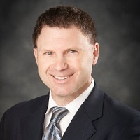

## Personal data
  
Name:   Roger Royse  
Location: USA  
## Projects 
Name: [Leverj](../projects/leverj.md)  
Position: Legal Advisor   
## Contacts
[LinkedIn](https://www.linkedin.com/in/rogerroyse/)      
[Facebook](https://www.facebook.com/rroyse)  
[Twitter](https://twitter.com/rroyse00)    
[Website](http://rroyselaw.com/)
## About
Roger Royse is the founder of Royse Law Firm, PC, a business and tax law firm with offices in Silicon Valley, Silicon Beach and San Francisco. Roger practices in the areas of corporate and securities law, domestic and international tax, and mergers and acquisitions. He currently serves as Chair of the Tax Committee, Business Law Section, Vice Chair of the Tax Policy & Simplification Committee, Tax Law Section, of the American Bar Association and Chair of the State Bar of California Tax Section Tax Policy, Practice and Legislation Committee. Practicing since 1984, Roger’s background includes work with prominent San Francisco Bay area law firms as well as Milbank, Tweed, Hadley and McCloy in New York City. He is a frequent speaker, writer, radio guest, blogger and panelist for bar associations, CPA organizations, and business groups. Roger is a Northern California Super Lawyer, is AV Peer-Rated by Martindale Hubbell and has a 10.0 “Superb” rating from Avvo.
Roger is a past President of the Palo Alto Area Bar Association, an active member of several committees of the American Bar Association and State Bar of California, has been a participating instructor of corporate law for the Center for International Studies (Salzburg Austria), and is an adjunct Professor of Taxation (Corporate Tax, Property Transactions and International Taxation) for Golden Gate University. 
Roger is the founder of Silicon Valley AgTech and the philanthropic organization “Team Motion to Dismiss Cancer” which conducts high profile auctions of meetings with venture capitalists to raise money for charity and has been recognized for his efforts on behalf of The Leukemia & Lymphoma Society by being named the 2012 San Francisco Bay Area chapter Man of the Year.
