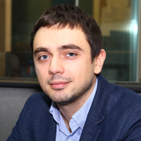

## Personal data
  
Name:   Roman Nester  
Location: Russian Federation    
## Projects 
Name: [Genesis Vision](../projects/genesis_vision.md)  
Position: Advisor   
## Contacts
[LinkedIn](https://www.linkedin.com/in/roman-nester-97b24755/)  
[Facebook](https://www.facebook.com/Nester84)
## About
Tech entrepreneur, passionate for big data, AI, machine learning, digital business.
CEO and co-founder at Segmento (segmento.ru) since 2011. Segmento is a leading data-driven omnichannel marketing platform.
Successfully raised 3 investment rounds in 2012-2013. In 2015 the company was acquired by Sberbank Group (LSE:SBER, largest Bank in Eastern Europe). In 2016 led Segmento to growth 3.5 times in revenue.
In 2016 made a new joint venture with SSA Sistema (LSE:SSA) to create a new technology and data leader in russian digital marketing.
Now managing a team of 110+ engineers, data scientists ad ops, sales team. Responsible for entire company strategy.
Cannes Lions’17 winner (Gold and bronze). Effie Awards 2017 winner (Silver).
Judge on WebSummit startup pitch.
