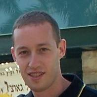

## Personal data
  
Name: Ron Merom  
Location: Mountain View, California  
## Projects 
Name: [WeTrust](../projects/wetrust.md)  
Position: Co-Founder & CTO
## Contacts
[LinkedIn](https://www.linkedin.com/in/ronmerom)  
## About
Ron previously worked at Google as a Software Engineer, where he specialized in voice recognition,
emerging markets and social interactions. Ron is passionate about blockchain technology and wants to use
his technical expertise to make a social impact on the lives of those less fortunate. He holds a M.Sc. in
Computer Science from the Weizmann Institute of Science and a B.Sc. in Computer Science and
Environmental Science from The Hebrew University