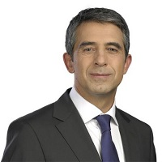

## Personal data
  
Name:   Rosen Plevneliev  
Location: Bulgaria  
## Projects 
Name: [LockChain](../projects/lockchain.md)  
Position: Chief Advisor   
## Contacts
[LinkedIn](https://www.linkedin.com/in/rosenplevneliev/)  
[Twitter](https://twitter.com/rplevneliev)
## About
[Wikipedia](https://ru.wikipedia.org/wiki/%D0%9F%D0%BB%D0%B5%D0%B2%D0%BD%D0%B5%D0%BB%D0%B8%D0%B5%D0%B2,_%D0%A0%D0%BE%D1%81%D0%B5%D0%BD)  
President of Bulgaria from 2012 to 2017 and one of the founders of the innovation ecosystemn of ICT in Bulgaria which has proven to be among the best ecosystems in Eastern Europe. President Plevneliev is a patron and co-founder of the software outsourcing and automotive ICT clusters. During his mandate, 80,000 jobs have been created in these industries. A passionate Software engineer according to his academic degree, In 1989 he graduated from the Higher Mechanical-Electrotechnical Institute, Sofia, and in the same year become a fellow at the Institute for Microprocessing Technology, Pravets. In 1982 he won first place in national contest for software engineering. 
Knows personally one of the most influential tech leaders in the world such as Bill Gates.
