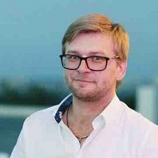

## Personal data
  
Name:   Ruslan Gavrilyuk  
Location: Singapore  
## Projects 
Name: [TaaS](../projects/taas.md)  
Position: Co-founder & President   
Name: [Jibrel Network](../projects/jibrel_network.md)  
Position: CryptoFinance Advisor
## Contacts
[LinkedIn](https://www.linkedin.com/in/ruslan-gavrilyuk/)      
[Facebook](https://www.facebook.com/ruslan.gavrilyuk.35)
## About
Gavrilyuk has more than 14 years’ experience in founding and managing projects in geoscience, mobile money solutions, oil and gas operations, precious minerals mining, sports and fashion. Realizing the urgent need for accessibility, security, transparency and mutually-beneficial decentralized cryptoactivity in finance, Gavrilyuk turned his focus to crypto- and blockchain financial projects. Gavrilyuk’s global experience spans East and West Africa, the Middle East, Europe, and America.
