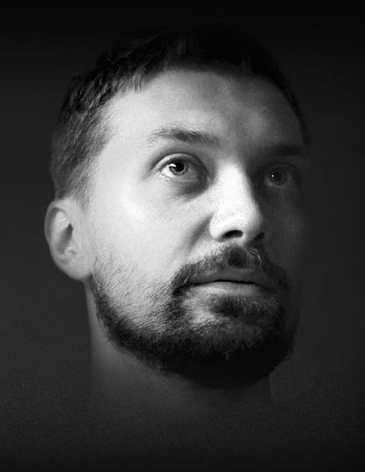

## Personal data
  
Name: Ruslan Khusnutdinov  
Location: Russia  
## Projects 
Name: [BMCHAIN](../projects/bmchain.md)  
Position: Creative director
## Contacts
[LinkedIn](https://www.linkedin.com/in/ruslan-khusnutdinov-5b440a110/)  

## About
Born in Russia. Started career as an illustrator in 2006. Went a long way from designer to art director, working in different advertising agencies.
From 2012 to the present day completely devoted to the business community "BM" in a position of chief art director.
In 2015 together with a my wife Annis Lender founded "WoodMass" — production and furniture boutique of massive wooden furniture. 
In 2006 together with like-minded creative team founded a web interface-oriented "KULT" advertising agency, specializing in innovative international projects in the field of science. The main office ща company is located in Helsinki, Finland.

Also knows as speaker at "BM" Business Community in 'Web and media communications’ blocks, and curator of creative business startups in Moscow.

The main principle in work: every communication should bring value both sides 