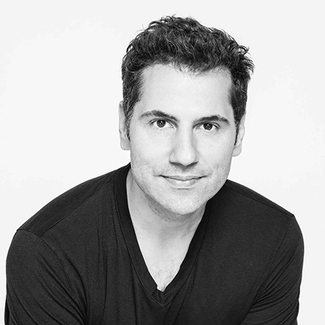

## Personal data
  
Name: Sam Tabar  
Location: New York  
## Projects 
Name: [AirSwap](../projects/airswap.md)  
Position: Strategy  
## Contacts
[LinkedIn](https://www.linkedin.com/in/sam-tabar-14a24698/)   
[Twitter](https://twitter.com/samirtabar)  
## About
Sam has 17 years of experience in the finance industry. He was a partner to FullCycle, a private equity social impact fund. Before that, he was Head of Capital Strategy at Bank of America Merrill Lynch based in Hong Kong. He helped build Sparx, the largest asset manager in Japan. He started his career in New York as a lawyer for Skadden, Arps, Meagher, Slate & Flom. He is a graduate of Columbia Law School and Oxford University.