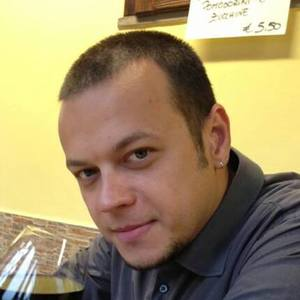

## Personal data
  
Name: Sebastian Stupurac  
Location: Israel  
## Projects 
Name: [Wings](../projects/wings.md)  
Position: Co-Founder, Project&Product Core Team  
Name: [INS Ecosystem](../projects/ins_ecosystem.md)  
Position: Strategy Advisor
## Contacts
[LinkedIn](https://www.linkedin.com/in/sebastian-stupurac-6bbb1712/)  
[Twitter](https://twitter.com/bdevelle)  
[Medium](https://medium.com/@bdevelle)  
[Bitcointalk Profile](https://bitcointalk.org/index.php?action=profile;u=355039)  
## About
Co-Founder of Wings, a successful community engagement and smart contract facilitation platform, one of the few working DAPPS on the Ethereum blockchain. Vast experience in decentralized solutions and blockchain technology since 2013.
