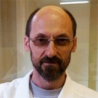

## Personal data
  
Name: Sergey Chernyshev ](../people/) 
Location:
## Projects 
Name: [ARNA Panacea](../projects/arna_panacea.md)  
Position: Ph.D., molecular biotechnologist
## Contacts

## About
Branch of the Institute of Bioorganic Chemistry. Acad. M.M. Shemyakin and Yu.A. Ovchinnikov Institute of Sciences, Pushchino. Specialization — molecular biology, biotechnology, genetic engineering. Area of ​​scientific interests: regulation of gene expression, transcription, translation, molecular mechanisms of bacterial phage lysis. 