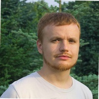

## Personal data
  
Name:   Sergey Lonshakov  
Location: Russian Federation  
## Projects 
Name: [DAO IPCI](../projects/dao_ipci.md)  
Position: Co-founder & Architect   
## Contacts
[LinkedIn](https://www.linkedin.com/in/ensrationis/)      
[Facebook](https://www.facebook.com/EnsRationis2020)  
## About
Work (research/develop) with: 
- Bitcoin/Altcoin/cryptocurrency projects since 2011. 
- Smart contract/Ethereum platform projects since 2014.
- DAO (decentralized autonomous organization) projects since 2015.  

Since September 2015 he has been researching of capabilities Ethereum platform for DAO and IoT solutions. 
