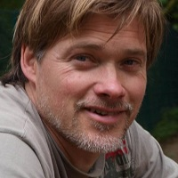

## Personal data
  
Name:   Simon Cocking  
Location: Ireland  
## Projects 
Name: [HydroMiner](../projects/hydrominer.md)  
Position: ICO Advisor   
## Contacts
[LinkedIn](https://www.linkedin.com/in/simon-cocking-20540135/)     
[Twitter](https://twitter.com/simoncocking)  
## About
Company founder, writer, journalist, content creator, digital marketing advisor.
Winner of Irish Web Awards 2014, best Science & Technology category.
Winner 2016 Littlewoods Best Ireland Blog for Digital & Tech.
Based in Ireland for over 20 years, excellent network of contacts.
Write regularly for IrishTechNews, Sunday Business Post, Irish Times, G+D, Dublin Globe, Tweakyourbiz, UCD Innovation Academy, Digital Skills Academy, IBM.
Since moving to Ireland, he has started four companies, two coops and one national sporting organisation. 
