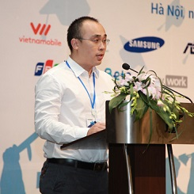

## Personal data 
  
Name: Snguyen  
Location: ---
## Projects 
Name: [Zcoin](../projects/zcoin.md)  
Position: Developer
## Contacts
-//-
## About
Snguyen has 18 years of programming experience (C++, Java, Python, NodeJS and Go recently). He has attended and received international prizes for programming, such as IOI, ACM-ICPC, Imagine Cup and Google Code Jam. He returned to Vietnam in 2011 and has been working in CocCoc (the number 2 browser in Vietnam, only after Chrome) since then with a Tech lead role.
