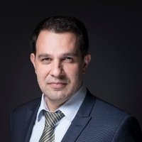

## Personal data
  
Name:   Stephane Ifrah  
Location: France    
## Projects 
Name: [Napoleon X](../projects/napoleon_x.md)  
Position: CEO   
## Contacts
[LinkedIn](https://www.linkedin.com/in/stephane-ifrah-4292a2/)    
[Twitter](https://twitter.com/ifrahstephane)  
[Facebook](https://www.facebook.com/stephane.ifrah.9)
## About
Stephane started developing algorithmic strategies more than 10 years ago at BNP Paribas. Stephane headed an investment team managing EUR 4.0bn until 2013. He then turned to entrepreneurship and participated in the launch of a Hedge Fund. He has built a more than 20 long standing scalable strategies library over the years. More recently, he has started developing for the crypto currency world. He graduated from the best MS in France (École Polytechnique) and holds another MS degree from ENSP. He also holds a Data Science certification from École Polytechnique.
