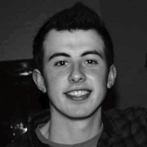

## Personal data
  
Name: Tadhg Riordan  
Location: Ireland
## Projects 
Name: [Zcoin](../projects/.md)  
Position: Solidity Developer
## Contacts
[LinkedIn](https://www.linkedin.com/in/tadhg-riordan-329093130/?ppe=1)  
[Facebook](https://www.facebook.com/people/Djm-ThreeFour/100011009258462)  
## About
Tadhg Riordan is a 24 year old Software Developer from Wexford, Ireland. He recently completed my MSc from Trinity College Dublin, where he worked with Blockchain privacy mechanisms, focusing particularly on Zero-Knowledge Proofs and the Ethereum platform. He is a strong advocate for the adoption of crypto-currency and for complete financial privacy.
