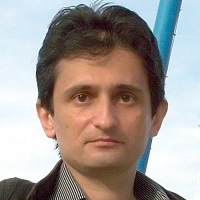

## Personal data
  
Name:   Tomislav Gountchev  
Location: USA
## Projects 
Name: [Ignis](../projects/ignis.md)  
Position: Lead Software Architect 
## Contacts
[LinkedIn](https://www.linkedin.com/in/gountchev/)   
## About
Tomislav Gountchev is a server-side Java developer with more than 15 years of professional experience. He has a scientific background, having obtained a B.A. in Natural Sciences from Cambridge University, and a Ph.D. in Chemistry from UC Berkeley.
After academia, Tomislav made a career switch and worked as a software engineer for e-commerce companies in the Silicon Valley, NexTag and eBay, with particular interest in Java search engine technology. Later he co-founded Nabble, a website for hosted public forums, where he spent several years as a senior Java engineer, responsible for the design and implementation of multiple backend components. He briefly worked as an R&D software engineer for an open source enterprise CMS company in the Netherlands, before becoming interested in blockchain technology.

 
