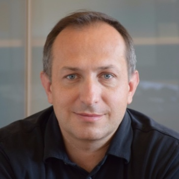

## Personal data
  
Name: Tomislav Mucic  
Location: Slovenia
## Projects 
Name: [Hive project](../projects/hive.md)  
Position: Blockchain auditing 
## Contacts
[LinkedIn](https://www.linkedin.com/in/tomislav-mu%C4%8Di%C4%8D-8486a7/)  
[Facebook](https://www.facebook.com/tomislav.mucic.5)  
[Twitter](https://twitter.com/TomoMucic)  
[Website](https://www.netis.si/)
## About
Tomislav has decades of experience in IT security and Project development and an early adopter of the Blockchain technologies. He is a CEO and Founder of Netis. 
His company is specialised in crypto-currency and blockchain technology development, consulting, mining and implementation of new applications based on this breakthrough technology.
