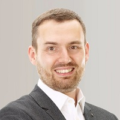

## Personal data
  
Name:   Tristan Colombet  
Location: United Kingdom  
## Projects 
Name: [DomRaider](../projects/domraider.md)  
Position: Co-founder & CEO     
## Contacts
[LinkedIn](https://www.linkedin.com/in/tristancolombet/)    
[Twitter](https://twitter.com/tristancolombet)  
[Facebook](https://www.facebook.com/colombet)
## About
Tristan founded his first company, Prizee.com, when he was just 18 years old. His platform, designed for the purpose of organizing and hosting prize competitions for the general public, became the leading casual gaming site in France in just a few years. Prizee.com was awarded first prize in the Deloitte Technology Fast 50 award program in 2006, having achieved 6,577% growth in five years. By the following year, the company had reached the 150-employee mark and was generating €13.7M in annual turnover. In 2012, with the Prizee network now attracting more than 35 million players, Tristan was approached by the international Digital Virgo Group, which had ambitions to deploy the gaming site worldwide. The sale took place and was concluded in the space of just a few months. Ceding ownership of the company enabled Tristan to finance Eefficiency, his very own startup-dedicated investment fund. One notable investment he made in particular was in Linxo, which has since gone on to become one of the leading lights in FinTech in France. In 2013, Tristan founded DomRaider, which in less than two years became the number one "drop catching" (expired domain name reservation) service in France. The company achieved exponential growth in 2016, with its workforce expanding in size from 5 to 28 employees. By the beginning of 2017, DomRaider was officially registered in 15 countries and had opened its first 3 offices outside France. In June 2016, Tristan was elected to the board of trustees of AFNIC, the official registry of the .fr top level domain name under the authority of France's Minister of the Digital Economy. In 2017, Tristan launched the Turing22 project, which involves extending and renovating around 5,000 m² of latest generation office and coworking space at the La Pardieu technology park. The space is already home to Bivouac, the startup accelerator serving France's Clermont-Auvergne urban region, an area that received "French Tech" accreditation.
