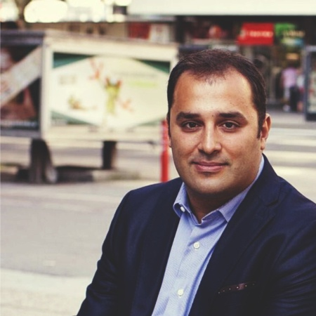

## Personal data
  
Name: Ugur Yildirim  
Location: Slovenia
## Projects 
Name: [Hive Project](../projects/hive.md)  
Position: Finance Advisor  
## Contacts
[LinkedIn](https://www.linkedin.com/in/ugur-yildirim-2986278/)  
[Twitter](https://twitter.com/YILDIRIM_UGUR)  
## About
Ugur has over 15 years of investment management experience and is a co-founder and partner of Elements Capital Partners, a firm which specialises in distressed investment opportunities and turnaround cases.
A member of the World Turnaround Management Association (TMA), Ugur has also served on the boards of several investment management firms in SEE. 
