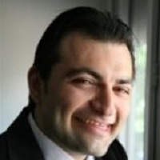

## Personal data
  
Name:   Vidal Chriqui  
Location: France  
## Projects 
Name: [Tokenza](../projects/tokenza.md)  
Position: Advisor   
## Contacts
[LinkedIn](https://www.linkedin.com/in/vidal-chriqui/)      
## About
Vidal Chriqui is a regular speaker at worldwide tech conferences. He is evangelizing blockchain technologies and specializes in Open Distributed Ledger protocols and micropayment channels.
Vidal is technical expert and advisor in distributed systems and decentralized networks. As an early adopter of Bitcoin, he launched a french web series called Blockchain Révolution, which is composed of 10 hours of exclusive lessons and interviews.
Vidal is also working with both large corporations and startups to help them develop new blockchain-based products and innovations in the crypto space.
