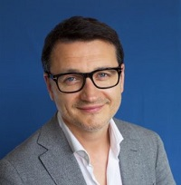

## Personal data
  
Name:   Vladimir Serzhanovich  
Location: Belarus  
## Projects 
Name: [CopPay](../projects/coppay.md)  
Position: Co-founder & Сhairman of the board of directors   
## Contacts
[LinkedIn](https://www.linkedin.com/in/vladimir-serzhanovich-a92b6090/)      
[Facebook](https://www.facebook.com/profile.php?id=100000719941849)
## About
19 years is successfully engaged in business. He created projects in retail and service sectors from scratch. Successful entrepreneur since 1998. Venture investor. The founder of the blockchain laboratory Consensus Lab, the blockchain school, the blockchain hackathon, etc. In CopPay project is actively engaged in attracting investment, building a team and business processes.
